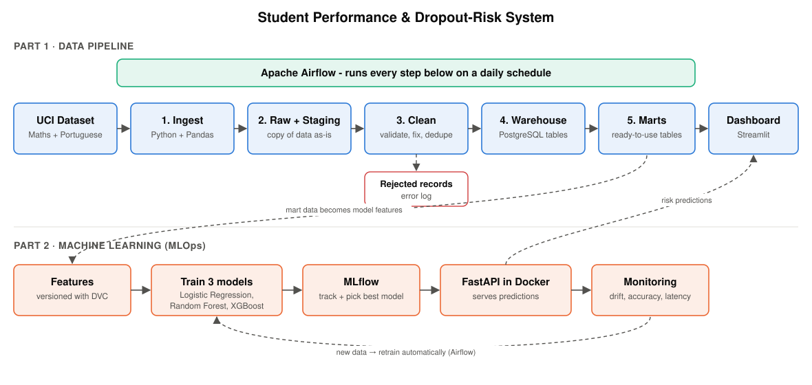

# Student Performance and Dropout-Risk Prediction System
### Project Report – Data Engineering and MLOps (Project 1)

> Draft report generated from the implemented system. All numbers come from the actual pipeline run in `docs/evidence/`. Review it, add your name and course details, and rewrite the explanations in your own words before submitting.

---

## 1. Problem understanding

Schools usually find out that a student is struggling only after the final exam, when it is too late to help. The goal of this project is to build a system that:

1. collects student academic records into one reliable, clean database;
2. shows teachers dashboards about performance, attendance and risk;
3. flags, **before the final exam**, the students who are likely to fail, so they can get early help (tutoring, attendance follow-up, mentoring).

The project has two parts:

- **Part 1 – Data pipeline:** ingestion, cleaning, validation, a PostgreSQL warehouse, analytical tables and a dashboard, orchestrated with Apache Airflow.
- **Part 2 – MLOps:** a machine-learning model that predicts failure risk. It is tracked with MLflow, versioned with DVC, served with FastAPI in Docker, and monitored for drift with automatic retraining.

**Prediction target (Part 2):** `fail = 1` if the student's final grade G3 is below 10 out of 20. The prediction is made at the end of the second period, when G1, G2 and attendance are already known, which leaves time to intervene.

---

## 2. Data source

| | |
|---|---|
| Dataset | UCI Student Performance (id 320), Cortez & Silva (2008) |
| Access | https://archive.ics.uci.edu/dataset/320/student+performance (downloaded automatically by the pipeline) |
| Licence | CC BY 4.0, free and public, fully anonymised |
| Content | 2 files: Mathematics (395 rows) and Portuguese (649 rows), 33 columns each |

Each row is one student in one subject at one of two Portuguese secondary schools (GP, MS). The columns are:

- demographics: age, sex, address, family size, parents' education and jobs
- study habits: study time, past failures, support, activities
- social life: going out, alcohol use, health
- `absences`
- three grades: G1 (period 1), G2 (period 2) and G3 (final)

**Why only UCI:** the brief names UCI as the primary dataset and lists the other sources as optional. Using only UCI keeps all the data real and public. The two files act as two sources, and matching students across them is a real identifier-standardisation problem.

**Limitations:** UCI gives only a yearly absence count, so attendance % uses an assumed 120 sessions per subject per year. There are no assignment records, so "assignment completion rate" is not available.

Full access instructions are in `docs/dataset_sources.md`.

---

## 3. Architecture

The system follows the layered design suggested in the brief:

| Layer | Implementation |
|---|---|
| Source | UCI zip over HTTP |
| Ingestion | Python + Pandas (`src/ingestion/ingest.py`) |
| Orchestration | Apache Airflow 2.10, DAG `student_academic_analytics_pipeline`, daily |
| Raw | `data/raw/<run_id>/`, an untouched copy of every download + `manifest.json` |
| Staging | `staging.stg_uci_student`: every value stored as text exactly as received, with source file, line and run id |
| Transformation | validation rules, de-duplication, type casting, missing-value handling, student-id standardisation |
| Storage | PostgreSQL 16, star schema in `analytics` + `audit` logging tables |
| Analytics | three data marts + a 7-page Streamlit dashboard |
| MLOps | DVC → training (MLflow) → model registry → FastAPI in Docker → monitoring → retraining (Airflow) |

---

## 4. Data ingestion

`src/ingestion/ingest.py` does the following on every run:

1. **Downloads** the UCI zip, with 3 retries on network failure. An offline mode via `UCI_LOCAL_ZIP` is also supported.
2. **Keeps a raw copy** of the zip and the extracted CSVs in `data/raw/<run_id>/`. These files are never modified.
3. **Checks the structure** of each file. It must have exactly 33 columns, and any malformed line is captured, not silently dropped.
4. **Records an audit entry** for each file in `audit.ingestion_log`: extraction time, source, status (SUCCESS/FAILED), row count, failed-row count, raw path and SHA-256 checksum. It also appends to `logs/extraction_audit.log`.
5. **Handles errors:** a failed download or bad file is logged as FAILED with the error message, then the task fails, so Airflow retries it twice.

Result of the demonstrated run: Mathematics 395 rows, Portuguese 649 rows, both SUCCESS, 0 malformed lines.

---

## 5. ETL, validation and storage

### 5.1 Staging
The raw CSVs are loaded into `staging.stg_uci_student` as TEXT, plus lineage columns. Keeping the original values means every rejected record can be traced back to its file and line.

### 5.2 Validation rules
Each rule is a small, unit-tested function (`src/etl/validation.py`). A row that breaks a rule goes to `audit.rejected_records` with the rule name, the reason and the full original record as JSON. It is also written to `logs/rejected_records.log`.

| Rule | Example |
|---|---|
| missing_required_field | empty sex or grade |
| non_integer_value | age = "seventeen" |
| invalid_category | school = "XX" |
| invalid_marks | grade 25 or −1 (allowed 0–20) |
| value_out_of_range | age 30, study time 7 |
| duplicate_record | exact duplicate row in the same file |
| duplicate_student_subject | same student twice in one subject |

Missing attendance (`absences`) is **not** rejected. It is filled with the subject median and flagged with `absences_imputed = true`.

The UCI data turned out to be clean: **0 of 1,044 rows were rejected** in the real run. The rules are proven by unit tests that feed in bad rows (invalid marks, wrong categories, duplicates, missing values), and all 10 tests pass.

### 5.3 Student-identifier standardisation
The two UCI files have no student id, and many students appear in both. Following the dataset authors' own merge script, a student is identified by 13 demographic attributes. The pipeline hashes them into a `match_key`, separates genuinely different students with the same key by their order of occurrence, and assigns canonical ids `STU00001…`.

Result: **674 distinct students**, of whom **370 study both subjects** and get the same id in both. (The authors report 382 matches; they use a plain join that pairs up students with duplicate keys, while this pipeline keeps a strict one-to-one match.)

### 5.4 Star schema (PostgreSQL)

- **Dimensions:** `dim_student` (674), `dim_subject` (2, with department), `dim_term` (Period 1, Period 2, Final)
- **Facts:** `fact_student_term` (3,132 rows: grade per student × subject × term, with previous-term grade and change), `fact_enrollment` (1,044 rows: one per student × subject)
- **Data marts:**
  - `mart_student_subject`: wide feature table + rule-based risk
  - `mart_subject_term_summary`: department × school × term pass rates
  - `mart_student_overview`: one row per student

**Features created:** attendance %, average internal marks ((G1+G2)/2), previous-semester grade (G2), grade trend (G2−G1), pass/fail, and a rule-based early-warning risk score.

### 5.5 Data-quality checks
After loading, 14 checks run and are stored in `audit.dq_results`. Critical checks stop the pipeline if they fail. They cover:

- staged rows equal ingested rows
- at least 95% of rows survive cleaning
- unique, well-formed ids
- grades in 0–20 and attendance in 0–100
- correct grain (3 term rows per enrolment)
- no orphan facts

**All 14 passed.** One warning-level observation: 53 enrolments (5.1%) have a final grade of 0 despite earlier grades. This usually means the student did not sit the final exam, which is itself a dropout signal.

---

## 6. Visualisation and interpretation

The Streamlit dashboard (`make dashboard`) reads directly from the warehouse and has sidebar filters for school, subject, sex and age.

| Page | What it shows |
|---|---|
| Overview | KPIs: 674 students, 1,044 enrolments, pass rate 78.0%, average attendance 96.3%, 167 high-risk enrolments; pass/fail and risk by subject; grade distribution |
| Performance Analysis | attendance vs. marks scatter and table; subject-wise pass/fail by school; department & term performance (line + heatmap); study time and past failures |
| High-Risk Students | filterable intervention list (rule-based score + ML probability), CSV download |
| Student Profile & Intervention | grade trajectory, triggered risk rules, suggested interventions per subject |
| Risk Prediction | what-if form that calls the FastAPI model |
| Data Quality & Pipeline | pipeline runs, ingestion log, DQ checks, rejected records, table row counts |
| Model Monitoring | model comparison, confusion matrix, feature importance, drift report |

**Key findings**
- Mathematics is much harder: pass rate **67.1%** vs **84.6%** in Portuguese.
- School GP outperforms MS, especially in Portuguese.
- **Past failures** are the strongest background risk factor. Pass rate is about 80–85% with no failures, 40–60% with one, and about a third or less with two or more.
- More study time is linked to higher grades.
- Attendance alone barely correlates with the final grade (r = 0.05). Most students attend over 90%, so internal marks are far more informative.
- The rule-based early-warning score works: **73% of "High" risk enrolments actually failed**, against only **1.3% of "Low"**.

Screenshots are in `docs/evidence/screenshots/`.

---

## 7. Part 2 – Machine learning and MLOps

### 7.1 Features and split
- **Features (36):** demographics, study habits, attendance, G1, G2, average internal marks and grade trend. G3 is the label only.
- **Split:** 60/20/20 train / validation / test. It is **stratified by the label and grouped by student**, so a student who takes both subjects never appears in two splits. This prevents information leaking between them.

### 7.2 Models (tracked in MLflow)

| Model | Val F1 | Test accuracy | Test precision | Test recall | Test F1 | Test ROC-AUC |
|---|---|---|---|---|---|---|
| Logistic Regression (baseline) | 0.769 | 0.889 | 0.742 | 0.868 | 0.800 | 0.965 |
| Random Forest | 0.795 | 0.933 | 0.831 | 0.925 | 0.875 | 0.984 |
| **XGBoost (champion)** | **0.800** | 0.899 | 0.776 | 0.849 | 0.811 | 0.966 |

The champion is chosen on **validation F1**, not test F1, so the test set stays an honest final check. XGBoost won narrowly on validation, while Random Forest scored higher on the test set. With small data the ranking is close, which is worth discussing in the presentation.

The most important features are average internal marks and the period-2 grade.

Each MLflow run logs its parameters, metrics (train/val/test), confusion matrix, feature importance and the model with its input signature. The best model is registered as **`student-risk-classifier`**, with the alias **`champion`**.

### 7.3 Versioning
`dvc.yaml` defines two stages, `etl → train`. `dvc.lock` stores the hashes of the feature dataset and the model, and `params.yaml` holds all hyper-parameters. `dvc repro` re-runs only the stages that changed, and `dvc push` stores versions in the DVC remote.

### 7.4 Serving
`api/main.py` (FastAPI) exposes `/predict`, `/predict/batch`, `/health`, `/model`, `/metrics` and `/reload`. Inputs are validated (for example, grades must be 0–20).

The service runs in a `python:3.11-slim` Docker image (`make docker-up`) with library versions pinned to the training environment. Measured latency is about **7 ms at p95**. The dashboard's Risk Prediction page calls this API.

### 7.5 Monitoring and retraining
`src/ml/monitor.py` compares current data with the training data and checks:

- **Feature drift:** PSI per feature. For numeric features, the KS test must also agree, which prevents false alarms on small samples.
- **Class distribution:** predicted fail-rate vs training.
- **Performance:** F1 on newly labelled data.
- **Service health:** API error rate and p95 latency, taken from the request log.

**Drift alert criteria** (in `params.yaml`, shown as "retraining recommended"): flagged if more than 30% of features drift, any key feature drifts (grades, attendance, failures), F1 drops by more than 0.05, or the predicted fail-rate moves by more than 10 percentage points.

| Scenario | Result |
|---|---|
| Current warehouse data | no drift, F1 0.91, **no retraining** |
| 60 real API requests | no drift, **no retraining** |
| Simulated weaker cohort (`make monitor-drift`) | 4 key features drifted, F1 0.81 → 0.57, fail-rate 23% → 56%, **retraining recommended** |

The Airflow DAG `student_risk_ml_pipeline` is triggered automatically after every successful data-pipeline run. It saves a monitoring report, **retrains and registers a new model version on every run**, and then re-scores all students into `ml.risk_predictions`. The retraining criteria above are reported in the monitoring report and dashboard so a human can see when the data has changed significantly.

**Model lifecycle:** new data → monitor → retrain → register (new version) → set alias champion → export → serve (Docker) → batch score.

---

## 8. Demonstration of the end-to-end run

| Step | Evidence |
|---|---|
| Pipeline run (CLI) | `docs/evidence/pipeline_run_output.txt`: 1,044 rows ingested, 0 rejected, 14/14 DQ checks passed |
| Airflow Part 1 DAG | `docs/evidence/airflow_dag_test_output.txt`, screenshot 08: all 7 tasks SUCCESS |
| Airflow ML DAG | screenshot 09: monitor → retrain → score, triggered automatically by the data pipeline |
| Warehouse sample | `docs/evidence/sample_mart_rows.txt`, `docs/evidence/schema_dump.sql` |
| Dashboard | screenshots 01–07 |
| MLflow | screenshots 10–11 (experiment runs, model registry) |
| FastAPI / Docker | screenshot 12, Risk Prediction page (screenshot 05) |
| Monitoring | `docs/evidence/monitoring_report.html` |

---

## 9. Challenges and decisions

- **No student id in the source:** solved with the 13-attribute match key from the authors' merge script, made strictly one-to-one.
- **Attendance only as a count:** converted to a percentage under a documented, configurable assumption (120 sessions).
- **Leakage risk:** students in both subjects could appear in train and test, so the split is grouped by student.
- **Environment:** the network blocks the default PyPI file host, so a mirror is configured through `PIP_INDEX_URL`. The MLflow UI's gunicorn workers crash on macOS, so a non-forking launcher is used.

## 10. Conclusion and future work

The system meets every Part 1 requirement and every Part 2 requirement. Possible next steps:

- add a real institutional source (ERP/LMS) using the same staging and validation pattern
- tune the decision threshold for higher recall, so fewer at-risk students are missed
- add a SHAP explanation for each prediction on the Student Profile page
- deploy the dashboard and API to a cloud host

## References
1. P. Cortez, A. Silva. *Using Data Mining to Predict Secondary School Student Performance.* FUBUTEC 2008.
2. UCI Machine Learning Repository – Student Performance: https://archive.ics.uci.edu/dataset/320/student+performance
3. Documentation: Apache Airflow, PostgreSQL, MLflow, DVC, FastAPI, Streamlit, scikit-learn, XGBoost.
